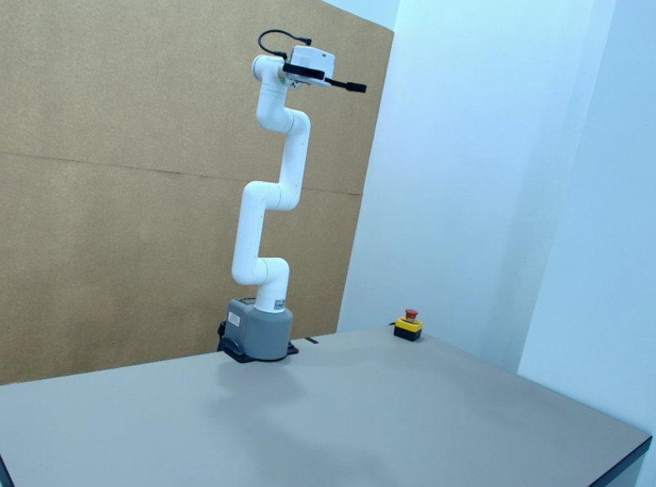

# myCobot Pro 450 Demos

Scripts Python de demostración para el brazo robot myCobot Pro 450. Diseñados para ejecutarse directamente desde tu laptop conectada al robot del laboratorio remoto.

Todos los scripts están en:

```
python/
```

Son archivos Python simples — ábrelos, léelos y modifícalos libremente. Cada uno es independiente y está pensado para que lo experimentes.



---

## Prerequisitos

- Python 3.8 o superior instalado en tu laptop
- Conectado al laboratorio remoto (Husarnet activo, acceso al robot)

---

## Inicio rápido

### 1. Clonar el repositorio

```bash
git clone https://github.com/Kalman-Robotics/brazo-robot-demos.git
cd brazo-robot-demos
```

### 2. Instalar las librerías

```bash
pip install --upgrade kalman-robot-arm
pip install matplotlib svgpathtools
```

### 3. Ejecutar un demo

```bash
cd ~/brazo-robot-demos/python/1\ Movimiento\ y\ trayectorias
python3 geometrias_3d.py
```

---

## Demos disponibles

> **Nota de seguridad:** los bloques físicos que el robot manipula no están colocados en el escenario del laboratorio. Todos los scripts ejecutarán los movimientos y las rutinas normalmente, pero el gripper no encontrará objetos que agarrar. Úsalos para observar el movimiento del brazo y entender la lógica de cada demo.

### Movimiento y trayectorias

```bash
cd ~/brazo-robot-demos/python/1\ Movimiento\ y\ trayectorias
```

---

### `geometrias_3d` — Traza un cuadrado, un círculo y un triángulo en el espacio

Para este demo se recomienda que el área de trabajo esté despejada. Puedes ajustar las dimensiones de cada figura y el plano de trabajo con los parámetros al inicio del script.

```bash
python3 geometrias_3d.py
```

**Qué hace:** El robot recorre tres figuras geométricas en un plano cartesiano fijo: un cuadrado, un círculo (interpolado con N puntos) y un triángulo equilátero. Al terminar genera un gráfico matplotlib comparando la trayectoria teórica con la posición real registrada con `get_coords()`.

**Qué usa:**
- `send_coords(pose, speed)` — mueve el extremo a coordenadas cartesianas
- `get_coords()` — lee la posición real del extremo para registrar la trayectoria
- `go_home()` — regresa a la posición de reposo al finalizar

**Parámetros** (al inicio del script): `LADO_CUADRADO`, `RADIO_CIRCULO`, `LADO_TRIANGULO` (dimensiones de las figuras) · `CENTRO_X`, `CENTRO_Y`, `PLANO_Z` (plano de trabajo) · `SPEED`, `N_PUNTOS_CIRCULO`

**Código:** [python/1 Movimiento y trayectorias/geometrias_3d.py](python/1%20Movimiento%20y%20trayectorias/geometrias_3d.py)

---

### `escritura_K` — Escribe la letra K con el extremo del brazo

```bash
python3 escritura_K.py
```

**Qué hace:** El robot traza la letra K en un plano cartesiano fijo simulando un bolígrafo: baja hasta la altura de dibujo, recorre cada trazo y levanta el extremo entre trazos. Al finalizar muestra un gráfico de la trayectoria teórica.

**Qué usa:**
- `send_coords(pose, speed)` — mueve el extremo a lo largo de cada trazo
- `gripper_close()` / `gripper_open()` — simula bajar y levantar el bolígrafo
- `go_home()` — regresa al finalizar

**Parámetros** (al inicio del script): `ORIGEN_X`, `ORIGEN_Y` (esquina inferior izquierda de la letra) · `ALTO_K`, `ANCHO_K` (dimensiones) · `PLANO_Z`, `Z_LEVANTE` (altura de dibujo y de levante) · `SPEED`, `SPEED_DRAW`

**Código:** [python/1 Movimiento y trayectorias/escritura_K.py](python/1%20Movimiento%20y%20trayectorias/escritura_K.py)

---

### `reach_envelope` — Genera la nube de puntos del workspace real

```bash
python3 reach_envelope.py
```

**Qué hace:** Barre sistemáticamente los rangos de J1 y J2 con J3–J6 fijos, registra la posición cartesiana real en cada pose con `get_coords()`, exporta los datos a un CSV y genera un gráfico 3D del espacio de trabajo alcanzable.

**Qué usa:**
- `send_angles(angles, speed)` — mueve el brazo a cada combinación de ángulos
- `get_coords()` — lee la posición cartesiana real `(x, y, z)` en cada pose
- `go_home()` — regresa al finalizar

**Parámetros** (al inicio del script): `RANGO_J1`, `RANGO_J2` (rangos con paso) · `J3_FIJO`–`J6_FIJO` (articulaciones fijas) · `SPEED`, `ESPERA_POST` · `CSV_SALIDA` (ruta del archivo de salida)

**Código:** [python/1 Movimiento y trayectorias/reach_envelope.py](python/1%20Movimiento%20y%20trayectorias/reach_envelope.py)

---

### Pick & Place

```bash
cd ~/brazo-robot-demos/python/2\ Pick\ \&\ Place
```
---

### `pick_place_basico` — Recoge un objeto de A y lo deposita en B

```bash
python3 pick_place_basico.py
```

**Qué hace:** Secuencia básica de pick & place: se aproxima a la posición A, agarra el objeto verificando el estado del gripper, lo transporta a B y lo deposita. Si el gripper no reporta objeto agarrado, reintenta hasta `MAX_REINTENTOS` veces antes de abortar.

**Qué usa:**
- `send_angles(pose, speed)` — mueve a las poses definidas por ángulos articulares
- `gripper_close()` / `gripper_open()` — agarre y suelta
- `get_gripper_status()` — verifica si hay objeto agarrado (estado `2` = sosteniendo)
- `go_home()` — regresa al finalizar o al abortar

**Parámetros** (al inicio del script): `POSE_HOME`, `POSE_A_APPROACH`, `POSE_A_PICK`, `POSE_B_APPROACH`, `POSE_B_PLACE` (poses en ángulos articulares) · `SPEED`, `SPEED_PICK` · `MAX_REINTENTOS`, `ESPERA_GRIPPER`

**Código:** [python/2 Pick & Place/pick_place_basico.py](python/2%20Pick%20%26%20Place/pick_place_basico.py)

---

### `apilado` — Apila y desapila bloques por capas

```bash
python3 apilado.py
```

**Qué hace:** Demostración de apilado en tres fases: (1) toma los bloques de la posición A capa por capa y los apila en B, (2) pausa en home, (3) deshace la pila de B y reconstruye A. Cada capa tiene su propia pose de pick y place con el Z correspondiente.

**Qué usa:**
- `send_angles(pose, speed)` — navega a cada pose de aproximación, pick y place
- `gripper_close()` / `gripper_open()` — agarre y suelta por capa
- `go_home()` — pausa y regreso entre fases

**Parámetros** (al inicio del script): `POSE_A_PICK_L0/L1/L2`, `POSE_B_PLACE_L0/L1/L2` (poses por capa) · `POSE_A_APPROACH`, `POSE_B_APPROACH` · `SPEED`, `SPEED_PICK`, `ESPERA_GRIPPER`, `ESPERA_HOME`

**Código:** [python/2 Pick & Place/apilado.py](python/2%20Pick%20%26%20Place/apilado.py)

---

### `distribucion_1_a_N` — Distribuye piezas a N destinos en abanico

```bash
python3 distribucion_1_a_N.py
```

**Qué hace:** Simula una línea de producción: recoge del mismo punto de origen y distribuye en secuencia a N zonas de destino dispuestas en abanico (solo varía J1 entre destinos, J2–J6 son comunes). Repite el ciclo `N_CICLOS` veces.

**Qué usa:**
- `send_angles(pose, speed)` — mueve a origen y a cada destino del abanico
- `gripper_close()` / `gripper_open()` — agarre y suelta en cada zona
- `go_home()` — regresa al finalizar todos los ciclos

**Parámetros** (al inicio del script): `POSE_ORIGEN_APPROACH`, `POSE_ORIGEN` · `DESTINOS_J1` (lista de ángulos J1 para cada destino, ej. `[25.0, 43.1, 61.0]`) · `_APPROACH_J2_J6`, `_PLACE_J2_J6` (J2–J6 compartidos) · `N_CICLOS`, `SPEED`, `SPEED_PICK`, `ESPERA_GRIPPER`

**Código:** [python/2 Pick & Place/distribucion_1_a_N.py](python/2%20Pick%20%26%20Place/distribucion_1_a_N.py)

---

### Programación y control

```bash
cd ~/brazo-robot-demos/python/3\ Programación\ y\ control
```

---

### `pid_posicion` — Control proporcional de posición en J1

```bash
python3 pid_posicion.py
```

**Qué hace:** Lazo de control P sobre la articulación J1: lee el ángulo actual, calcula el error respecto al setpoint, envía un comando proporcional al error y repite hasta converger dentro de la tolerancia o agotar el timeout. Muestra en tiempo real el estado del lazo en una tabla por terminal.

**Qué usa:**
- `get_angle(1)` — lee el ángulo actual de J1
- `send_angle(1, cmd, speed)` — envía el ángulo objetivo calculado a J1
- `go_home()` — regresa al finalizar

**Parámetros** (al inicio del script): `SETPOINT` (ángulo objetivo, ej. `45.0°`) · `KP` (ganancia proporcional, default `0.4`) · `TOLERANCIA` (banda de convergencia, ej. `±0.50°`) · `TIMEOUT` (tiempo máximo del lazo, `15.0 s`) · `DT` (período de muestreo, `0.1 s`) · `SPEED_BASE`

**Código:** [python/3 Programación y control/pid_posicion.py](python/3%20Programaci%C3%B3n%20y%20control/pid_posicion.py)

---

### Aplicaciones temáticas

```bash
cd ~/brazo-robot-demos/python/4\ Aplicaciones\ temáticas
```

---

### `barman` — Secuencia coreográfica de agarre y servido

```bash
python3 barman.py
```

**Qué hace:** El robot actúa como bartender: recoge un vaso, lo transporta a la posición de servido, inclina el extremo el ángulo configurado para simular el vertido, devuelve el vaso a su lugar y regresa a reposo. Es una demo de secuenciación coreográfica con verificación de agarre.

**Qué usa:**
- `send_angles(pose, speed)` — navega a cada pose de la secuencia
- `gripper_close()` / `gripper_open()` — agarre y suelta del vaso
- `get_gripper_status()` — verifica que el vaso esté agarrado antes de continuar
- `go_home()` — regresa al finalizar

**Parámetros** (al inicio del script): `POSE_VASO_APPROACH`, `POSE_VASO_PICK` · `POSE_SERVIR` · `POSE_DEVOLVER` · `INCLINACION` (ángulo de vertido en J4) · `SPEED`, `SPEED_PICK`, `ESPERA_GRIPPER`, `DURACION_SERVIR`

**Código:** [python/4 Aplicaciones temáticas/barman.py](python/4%20Aplicaciones%20tem%C3%A1ticas/barman.py)

---

## Resumen de métodos API usados

| Método | Descripción | Usado por |
|---|---|---|
| `send_coords(pose, speed)` | Mueve el extremo a coordenadas cartesianas `[X, Y, Z, RX, RY, RZ]` | geometrias_3d, escritura_K, dibujo_svg |
| `send_angles(angles, speed)` | Mueve el brazo a ángulos articulares `[J1..J6]` | reach_envelope, pick_place_basico, apilado, distribucion_1_a_N, barman |
| `send_angle(joint, angle, speed)` | Mueve una articulación individual | pid_posicion |
| `get_coords()` | Lee la posición cartesiana actual del extremo | geometrias_3d, reach_envelope |
| `get_angle(joint)` | Lee el ángulo actual de una articulación | pid_posicion |
| `get_gripper_status()` | Lee el estado del gripper (`2` = sosteniendo objeto) | pick_place_basico, barman |
| `gripper_close()` / `gripper_open()` | Cierra o abre el gripper | pick_place_basico, apilado, distribucion_1_a_N, barman, escritura_K, dibujo_svg |
| `set_fresh_mode(bool)` | Envío en ráfaga sin esperar entre puntos | dibujo_svg |
| `set_color(r, g, b)` | Cambia el color del LED de estado | todos |
| `go_home()` | Regresa a la posición de reposo | todos |
